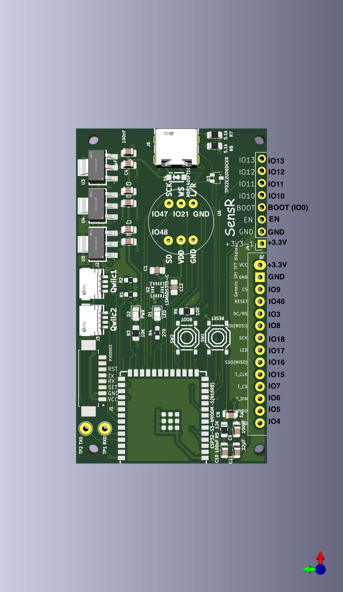

# Sensr Base Board

The base board includes a CPU, two independently powered I2C busses and Qwiic ports, and an integrated LSM6DS3TR-C accelerometer/gyroscope, header for a display and PMS5003 connector.

Because [JLCPCB apparently cannot correctly assemble boards with MEMS microphones](https://www.reddit.com/r/electronics/comments/1jy9k0o/warning_jlcpcb_cannot_reliably_handle_mems/) the board has a connector for an IMP451 microphone breakout instead of having an integrated MEMS microphone.

## DEFECT - IMPORTANT

Due to a pin selection mistake the two Qwiic/STEMMA QT connectors use pins (IO35, IO36, IO38) that are required for octal PSRAM.

You can either use the connectors or you can use PSRAM. If you want to use the connectors be sure to install firmware that does not enable PSRAM. If you do, best case you won't be able to run I2C on the connectors, worst case your firmware will crash.

If you want to use PSRAM and I2C you can map the two hardware I2C controllers to any other available GPIO pins. Be sure to use firmware built for octal PSRAM.

## 0.2 Pinout

| Name | Pin | Function |
|-----|-----|-------|
|SCL1|36|I2C1/Qwiic 1
|SDA1|35|I2C1/Qwiic 1
|SCL2|38|I2C2/Qwiic 2
|SDA2|37|I2C2/Qwiic 2
|PM SET|41|Particle Sensor SET
|PM RX|40|Particle Sensor RX
|PM TX|39|Particle Sensor TX
|LED|45|Built in LED - low to light
|MIC_DAT|48|I2S Microphone Output
|MIC_CLK|47|I2S Microphone Clock
|MIC_WS|21|I2S Microphone Word Select
|ACC_INT|14|Accelerometer Interrupt
|SDO|16
|SDI|12
|SCK|11
|CS|9
|DCRS|3
|DSP_RST|46
|BCKLT|17
|T_CLK|7
|T_CS|6
|T_DO|5
|T_IRQ|4



## Firmware

### CircuitPython

If you want to use PSRAM, the [YD-ESP32-S3 N16R8 firmware](https://circuitpython.org/board/yd_esp32_s3_n16r8/) works. 

If you want to use the Qwiic/STEMMA QT connectors, the [ESP32-S3-DevKitC-1-N16](https://circuitpython.org/board/espressif_esp32s3_devkitc_1_n16/) firmware works.

In either case the `board` pin definitions will be wrong.

#### Sound Level/Microphone

As of CircuitPython 9, it does not support I2S microphone input, so it
is not possible to monitor sound levels from CircuitPython using an
I2S microphone.

The `MIC_DAT`, `MIC_CLK` and `MIC_WS` pins are brought out on the I2S microphone connector on the board.

### EspHome

Use `board: esp32-s3-devkitc-1` and add this YAML:
```
esphome:
  platformio_options:
    board_build.flash_size: 16MB
    board_build.flash_mode: qio
    board_build.f_flash: 80000000L
```

If you want to use PSRAM and not use the Qwiic/STEMMA QT connectors,
add this YAML:
```
psram:
  mode: octal     # S3 N16R8 is octal PSRAM
  speed: 80MHz
```

If you want to use the Qwiic/STEMMA QT connectors, do not enable
PSRAM.
