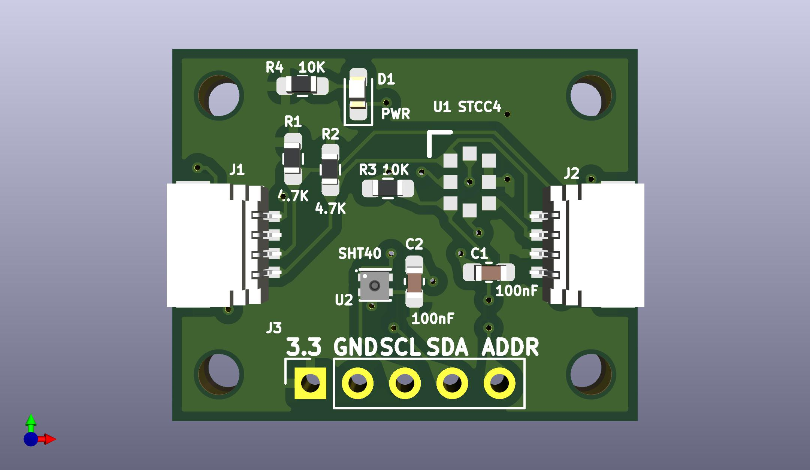

# Sensr Air STCC4

This breakout board has Sensirion's new CO2 sensor, the STCC4, as well as an SHT40 temperature/humidity sensor. The board also has two STEMMAQT/Qwiic connectors and a five pin header with power, I2C and the STCC4's address select pin.

This is a 3.3V board and has no voltage regulator, so don't use it with 5V circuits!

It also has a power LED.

The STCC4 has a selectable I2C address depending on the state of the ADDR line.  The ADDR line has a weak pulldown resistor so that the STCC4's default I2C address is 0x64. If ADDR is high, the address will be 0x65.

The SHT40 is not directly accessible from the I2C bus. Instead it connects to a private second I2C bus with the STCC4. Its values may be read through the STCC4.

## 0.1.0 Hardware



## Firmware

Example program in CircuitPython:

```
import time
import board
import busio
from adafruit_stcc4 import STCC4

# Initialize I2C bus
i2c = busio.I2C(board.SCL, board.SDA)

# Initialize STCC4 sensor
sensor = STCC4(i2c)

print("STCC4 CO2 Sensor Test")
print("=" * 50)

# Print sensor information
print(f"Serial Number: {sensor.serial_number}")
print(f"Firmware Version: {sensor.firmware_version[0]}.{sensor.firmware_version[1]}")
print(f"SHT40 Available: {sensor.sht40_available}")
print()

# Read CO2, temperature, and humidity measurements
print("Environmental Measurements:")
print("-" * 30)

while True:
    co2 = sensor.co2
    print(f"Reading {i+1:2d}: CO2: {co2:6.1f} ppm")
        
    if sensor.sht40_available:
       temperature, humidity = sensor.measure_temperature_humidity()
       print(f"           Temp: {temperature:5.1f}°C, Humidity: {humidity:5.1f}%")
    else:
       print("           SHT40 not available - no temp/humidity data")
        
    print()
        
    time.sleep(2)  # Wait 2 seconds between readings

print("Test complete!")
```

## License

Hardware is shared under the [CERN-OHL-S-2.0](CERN_OHL_S_v2.txt) license.

Software is shared under the [MIT license](MIT-LICENSE.txt).

Documentation is shared under the [CC-BY-SA-4.0](CC-BY-SA-4.0.txt) - Attribution-ShareAlike license.

